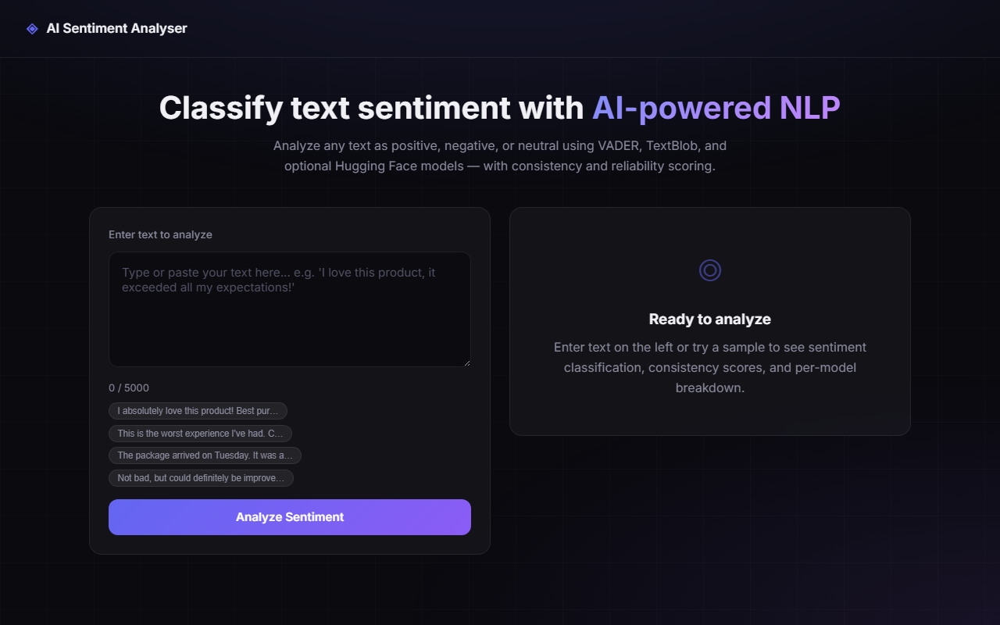

# AI Sentiment Analyser

A web-based tool that classifies text as **positive**, **negative**, or neutral using NLP and AI APIs, with scoring for output consistency and reliability.

**Live Demo:** [Add your live link here]()



## Features

- Multi-model sentiment analysis (VADER + Lexicon NLP)
- Optional Hugging Face API integration
- Consistency and reliability scoring
- Clean, responsive web UI
- Deployable on Vercel or Netlify

## Run Locally

```bash
python -m venv venv
venv\Scripts\activate          # Windows
pip install -r requirements.txt
python server.py
```

Open `http://localhost:8000`

## API

```bash
POST /api/analyze
Content-Type: application/json

{ "text": "I love this product!" }
```

## Tech Stack

Python · VADER · HTML/CSS/JS

## License

MIT
